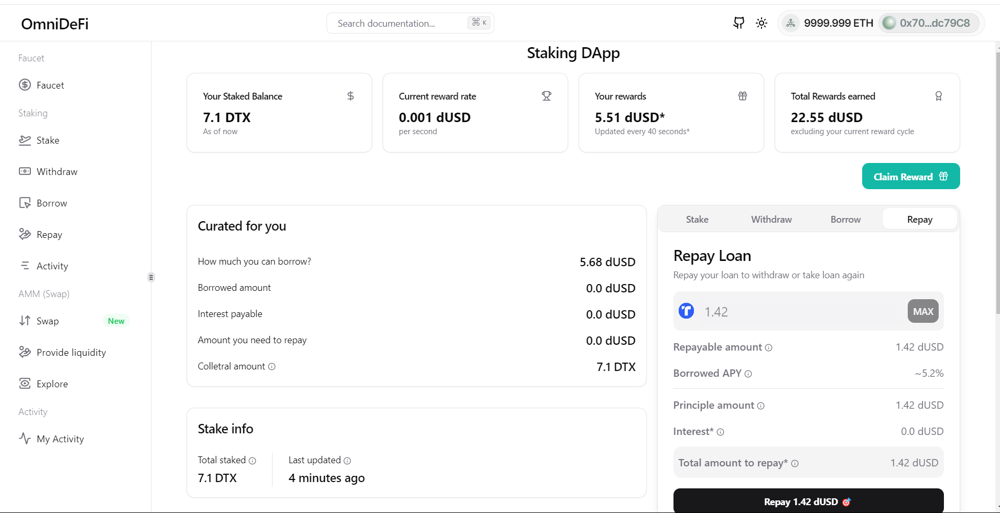
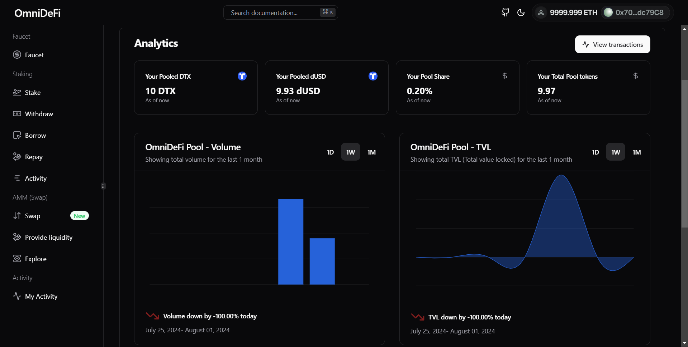
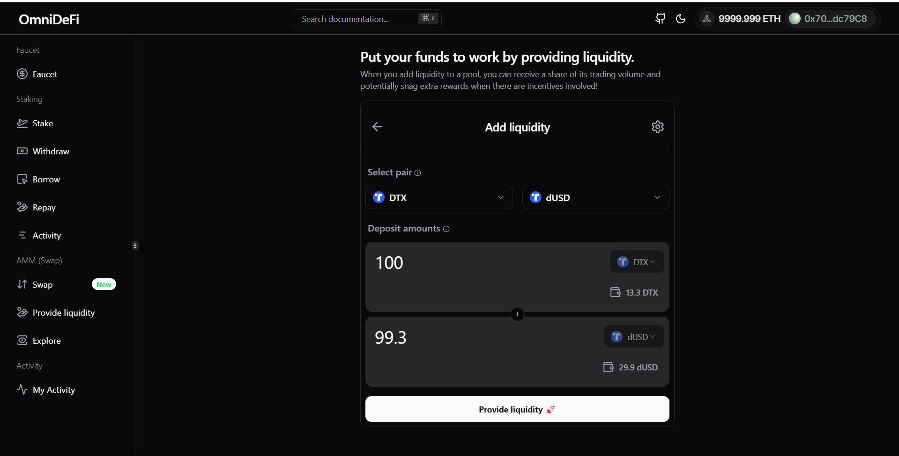
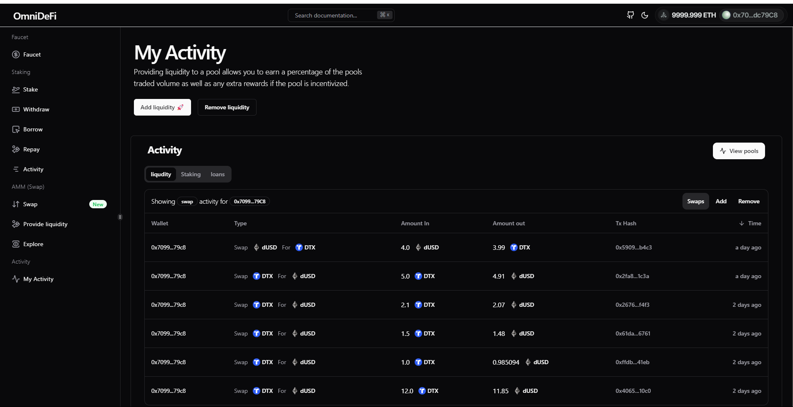
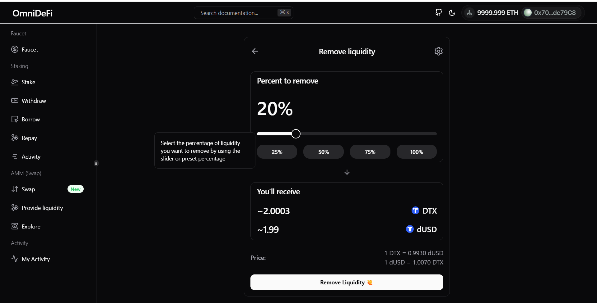
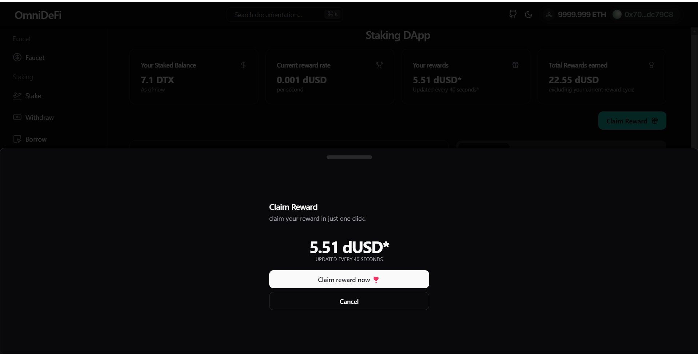

# AstraDeFi Client

AstraDeFi is a **decentralized finance (DeFi) platform** that offers a wide range of functionalities, including **lending**, **borrowing up to 80% of the staked amount**, **providing liquidity**, **swapping**, and **earning rewards**. This client is built to offer users a **smooth** and **responsive experience** for interacting with the AstraDeFi ecosystem.

## ✨ Features

- **Lending & Borrowing:** Borrow up to 80% of the staked amount directly from the platform and repay at your convenience.
- **Rewards:** Earn rewards by participating in the liquidity pools.
- **Automated Market Maker (AMM) Pools:** Provide liquidity to various pools and earn rewards through trading fees.
- **Liquidity Management:** Easily add or remove liquidity from multiple pools, ensuring flexibility for all users.
- **Swapping:** Effortlessly swap between different tokens with real-time price updates and low slippage.
- **Rewards Calculation:** Earn rewards for staking and liquidity provision, with automatic real-time reward updates.
- - **Faucets:** Get faucets (10 ATX/day) by just one click.
- **Activity Tracking:** Monitor all your activities including staking, lending, borrowing, and swaps in one unified dashboard.
- **Analytics & Charts:** Visualize token performance, trading volume, and liquidity pool stats with in-depth charts and graphs.
- **Dark and Light Modes:** Switch between dark and light modes to suit your preference.
- **Confetti Celebration:** Celebrate your successful transactions with visual confetti effects.


## 📸 Screenshots

### Platform Views

#### Platform (Dark Mode)


#### Platform (Light mode)


#### AMM Graphs


#### Provide Liquidity


#### My Activity


#### Remove Liquidity


#### Claim Rewards


### Other Views

- **Pools Overview**
- **Remove Liquidity**
- **Faucet** for testing purposes.

## 🛠️ Tech Stack

AstraDeFi uses modern web technologies to provide an efficient, scalable, and easy-to-use interface.

### Frontend:
- **Next.js** (v14.2.5): Server-side rendering and static site generation.
- **React.js** (v18): Component-based UI.
- **Tailwind CSS**: For modern and responsive design.
- **Radix UI**: A set of accessible UI components for React.
- **Three.js**: For 3D visualizations.
- **Framer Motion**: Animation library for smooth transitions.
- **Apollo Client**: For GraphQL data fetching.
- **Ethers.js**: Ethereum library for interacting with the blockchain.

### DevOps and Deployment:
- **Docker**: For containerization of the client.
- **AWS EC2**: Scalable cloud infrastructure.

## ⚡ How to Run the Project

To run the AstraDeFi client locally, follow these steps:

### Step 1: Clone the Repository

```bash
git clone https://github.com/your-username/astradefi-client.git
```

### Step 2: Install Dependencies
Navigate to the project folder and install the required dependencies.
```bash
cd client
npm install
```

### Step 3: Run the Project
For development mode, use:
```
npm run dev
```

## 🌐 Contributing
We welcome contributions from the community! Feel free to open an issue or submit a pull request to improve AstraDeFi.

## 📝 License
This project is licensed under the MIT License.
